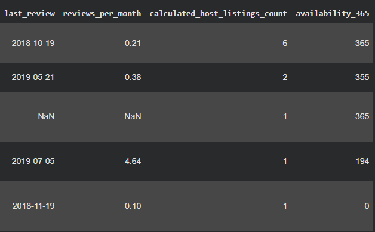
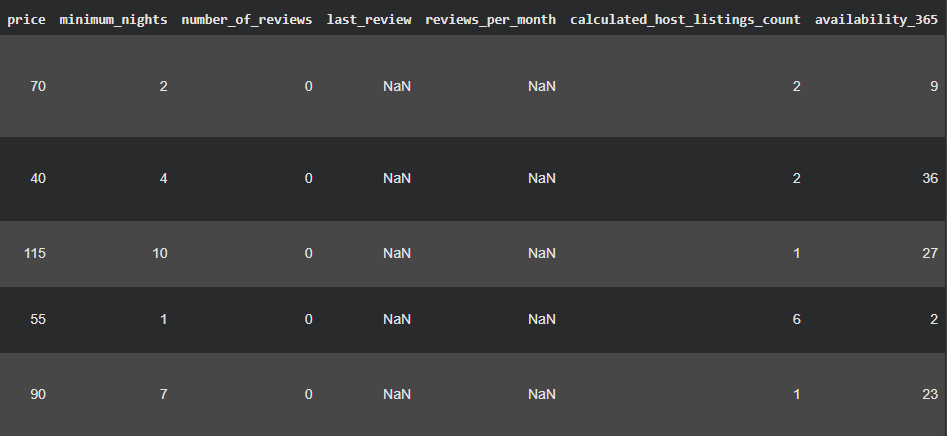
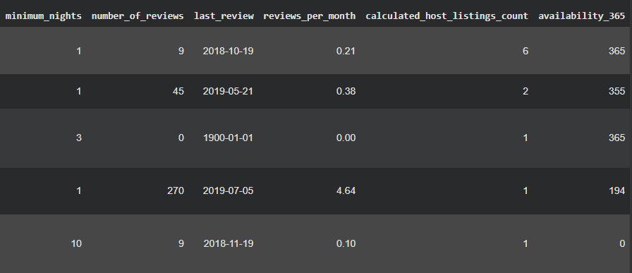
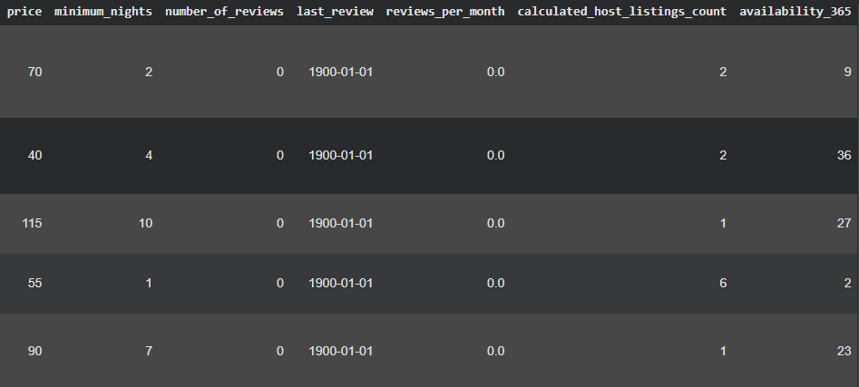
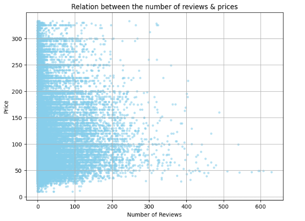
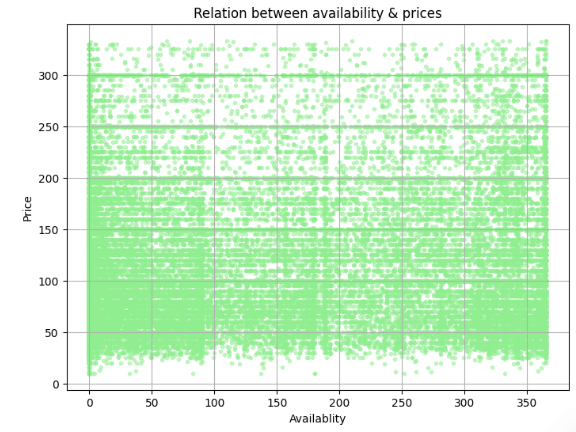

# 🏙️ NYC Airbnb Data: From Chaos to Clarity (Data Cleaning & Analysis)

### By Ahmed (16yo Aspiring Data Analyst)

---

## 🚀 Project Overview

This project showcases a complete Data Analytics workflow using a real-world dataset of **New York City Airbnb listings (2019)**. The primary goal was to transform a "messy" dataset into a clean, structured format and then derive meaningful visual insights. This is my very first professional data project, marking the start of my journey into Data Science and AI.

---

## 🛠️ The Data Processing Pipeline (Before & After)

A significant part of this project involved meticulous data cleaning to ensure accuracy. I handled missing values, removed duplicate entries, and filtered out extreme price outliers to ensure the analysis remains realistic.

### ❌ Part 1: Raw Data (The Messy State)
The raw dataset contained unhelpful columns, numerous missing values (`NaN`), and duplicates that could mislead the analysis.

* **Issues Identified:** Missing names/host_names, duplicate listings, and extreme price outliers.

### ✅ Part 2: Cleaned Data (The Professional State)
After applying Python and Pandas for cleaning, the data became structured and ready for analysis.

* **Actions Taken:** Dropped unnecessary columns, handled missing values, and focused on a realistic price range (up to $350).

---

## 📊 Visual Insights (Data Analysis)

In this phase, I used Scatter Plots to explore the relationships between different variables and understand the NYC Airbnb market dynamics.

### Insight 1: Relation between Number of Reviews & Prices
This chart visualizes how the price of a listing relates to the number of reviews it has received.

* **Key Finding:** There is a high concentration of listings with many reviews in the lower price range (under $150). This suggests that more affordable places tend to get more bookings and, consequently, more customer feedback.

### Insight 2: Relation between Availability & Prices
This chart examines whether the availability of a listing (number of days per year) affects its price.

* **Key Finding:** The data shows that price is not strictly dictated by availability. We can see "price floors" (horizontal lines) where many hosts tend to set standard prices (e.g., $100, $150, $200) regardless of how many days the property is available.

---

## 🛠️ Tools & Technologies Used

* **Language:** Python
* **Libraries:** Pandas (Data Manipulation), Matplotlib (Visualization)
* **Platform:** Google Colab
* **Version Control:** GitHub

---

## 📈 Future Steps (My Roadmap)

This project is just the beginning. I plan to continue my learning journey by:
1.  **Deep Learning:** Enrolling in Andrew Ng’s Deep Learning Specialization.
2.  **Advanced Modeling:** Building predictive models to estimate listing prices.
3.  **Portfolio Expansion:** Exploring more complex datasets in finance and technology.

---

**This project is a testament to my dedication as a 16-year-old self-taught data enthusiast. Thanks for visiting!**
